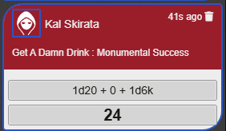
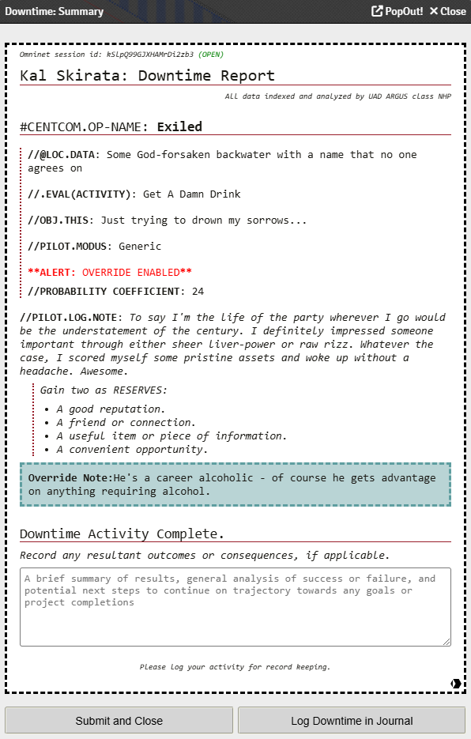
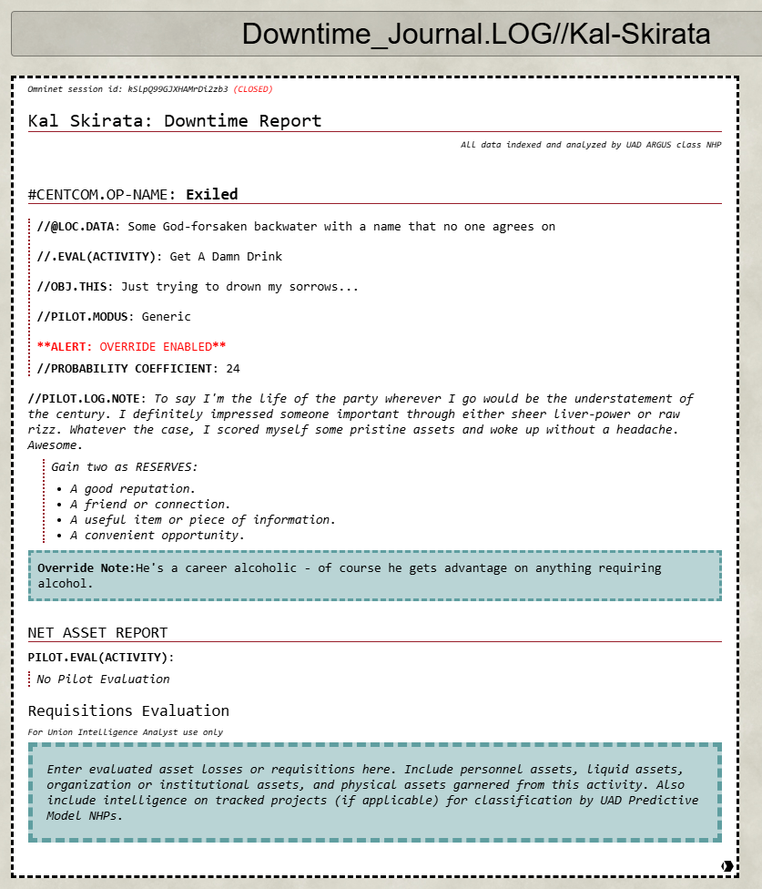

# Lancer_Downtime_Macro

This macro is meant to automate downtime rolls and create a report that can be added to a player's downtime journal so the player and GM can track assets gained, lost or changed from downtime activities.

Ensure your players have the ability to create journals/journal pages if you're going to let them use the downtime macro.

The macro does not need a pilot actor on the canvas to run, but will show a player all pilot actors they have access to.

## Customization

Flavor Text in Report
    * The script has alternative styling for people who want a more generic or unflavored experience. Locate the termSet function invocation and change the argument from 'diegetic' to 'rulebook' to have most of the fluff stripped from the report

Custom Activities Support (See V2 Changelog)
   * Custom activities with custom breakpoints are now supported

## V2 Changelog
1. Added 3 Different Types of overrides for players who want to augment their downtimes

   
   1. Flat Overrides - these add a flat bonus or malus to the roll (ie - 1, -2)
   2. Accuracy/Difficulty - add multiple stacking accuracy or difficulty to the roll
   3. Static Override - this will roll the result input. Especially useful if you need to replicate a roll that was done physically or if the player just forgot to log the downtime ot their journal. Note - Things can get a little weird here if you have custom activities with insanely high rolls, so play with it at your own risk and try and keep the rolls under a 100 max.
3. Flat Overrides & Acc/Diff Overrides can be combined so go nuts giving your players as many bonuses and maluses as you want. However, static overrides will take precedent over any other type of override

   
4. In addition, Overrides come with notes that show up in the output. Any roll that undergoes an override will say as much, so no players can sneak a fast one in on the GM.

   
5. Changes have been made to the underlying logic of the roll and the structure of the Activity Object that holds all Activity data. It should now be easier to make custom activities with custom breakpoints (as many as you want, theoretically) The new structure for the Activities Array is below
6. Journal Entries have been modified to also show Overrides and Override notes

   
7. Widened the dialog window for better readability

### V2 Custom Activity Sample w/ Variable Breakpoints
You can add custom activities to the macro for your campaign. You will need to add a new object to the Activities array to do so. If the activity isnt rol-based, simply set the "Rollable" param to "False" and omit the "RollRange" property from the Results array. Otherwise, each roll breakpoint should have its own object within the Results array. Additionally, the "createRange" function is not very complex, so ensure your ranges dont have any overlap or some strange things may happen.
    * <code>
    {Name: "New Custom Activity",
       Rollable: true,
       Results: [{
                  RollRange: createRange(1,4),
                  ShortDesc: "T1 Success",
                  LongDesc: "T1 Long Description",
                  Info: "T1 Informational Flavor Text"},
                  {
                  RollRange: createRange(5,9),
                  ShortDesc: "T2 Success",
                  LongDesc: "T2 Long Description",
                  Info: "T2 Informational Flavor Text"},
                  {
                  RollRange: createRange(10,14),
                  ShortDesc: "T3 Success",
                  LongDesc: "T3 Long Description",
                  Info: "T3 Informational Flavor Text"},
                  {
                  RollRange: createRange(15,19),
                  ShortDesc: "T3 Success",
                  LongDesc: "T3 Long Description",
                  Info: "T3 Informational Flavor Text"},
                  {
                  RollRange: createRange(20,100),
                  ShortDesc: "Monumental Success",
                  LongDesc: "Monumental Long Description",
                  Info: "Monumental Informational Flavor Text"},
                ]}
</code>

## Issues
1. going into negative rolls will result in bad functionality. need to implement a floor of 1 for all rolls and overrides.

## TO DOs for V3:
1. Better incrementing logic for journal entries in downtime folder
2. Render journal entries after they are logged to the journal

## Future wishlist:
1. Better organization support? (that could be nifty)
