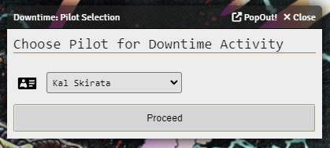
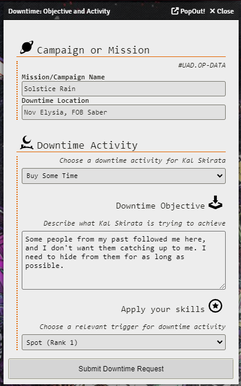
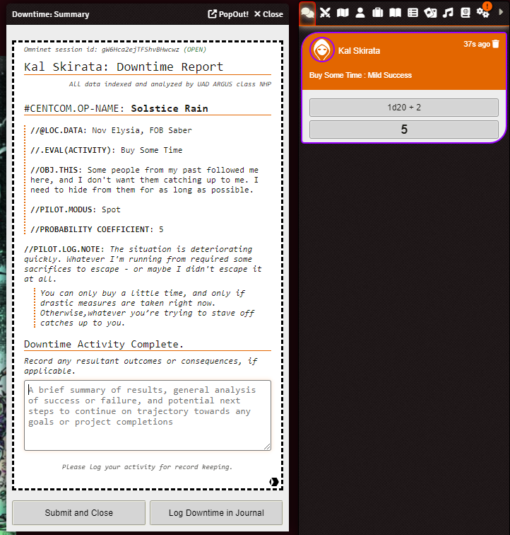
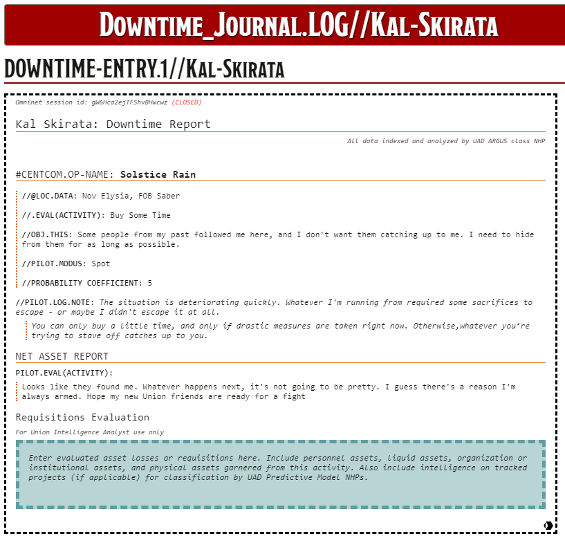

# Lancer_Downtime_Macro

This macro is meant to automate downtime rolls and create a report that can be added to a player's downtime journal so the player and GM can track assets gained, lost or changed from downtime activities.

Ensure your players have the ability to create journals/journal pages if you're going to let them use the downtime macro.

The macro does not need a pilot actor on the canvas to run, but will show a player all pilot actors they have access to.

## Customization

1. You can add custom activities to the macro for your campaign. You will need to add a new object to the Activities array to do so. The object model looks like this for a non-rolled activity (such as Power at a Cost or Get Focused)
    * <code>{Name: "Unrolled Activity Name",Rollable: false,Results: {0: {ShortDesc: "Success",LongDesc: "Some descriptive text",Info: "This is where I put the rules for the outcomes as they are listed in the core rulebook"}}}</code>
    
2. Activities that require rolling require a bit more configuration
    * <code>{Name: "Rolled Activity Name",Rollable: true,Results: {"0-9": {ShortDesc: "Mild Success",LongDesc: "Some descriptive text for a mild success",Info: "Detailed description from the book/ruleset"},"10-19": {ShortDesc: "Moderate Success",LongDesc: "Some descriptive text for a moderate success",Info: "Detailed description from the book/ruleset"},"20+": {ShortDesc: "Monumental Success",LongDesc: "Some descriptive text for a monumental success",Info: "Detailed description from the book/ruleset"}}}</code>
  
3. Flavor Text in Report
    * The script has alternative styling for people who want a more generic or unflavored experience. Locate the termSet function invocation and change the argument from 'diegetic' to 'rulebook' to have most of the fluff stripped from the report

## TO DOs for V4:
1. Better incrementing logic for journal entries in downtime folder
2. Render journal entries after they are logged to the journal
3. Add an admin override for manually inputing results as opposed to rolling for them
4. Add homebrew options for adding flat bonuses to rolls, as well as accuracy/difficulty and auto-succeed/fail (for GM overrides)

## Future wishlist:
1. Add support for custom downtime activities with variable breakpoints for outcome (ie 1-5, 6-10, 11-15, 16+)
